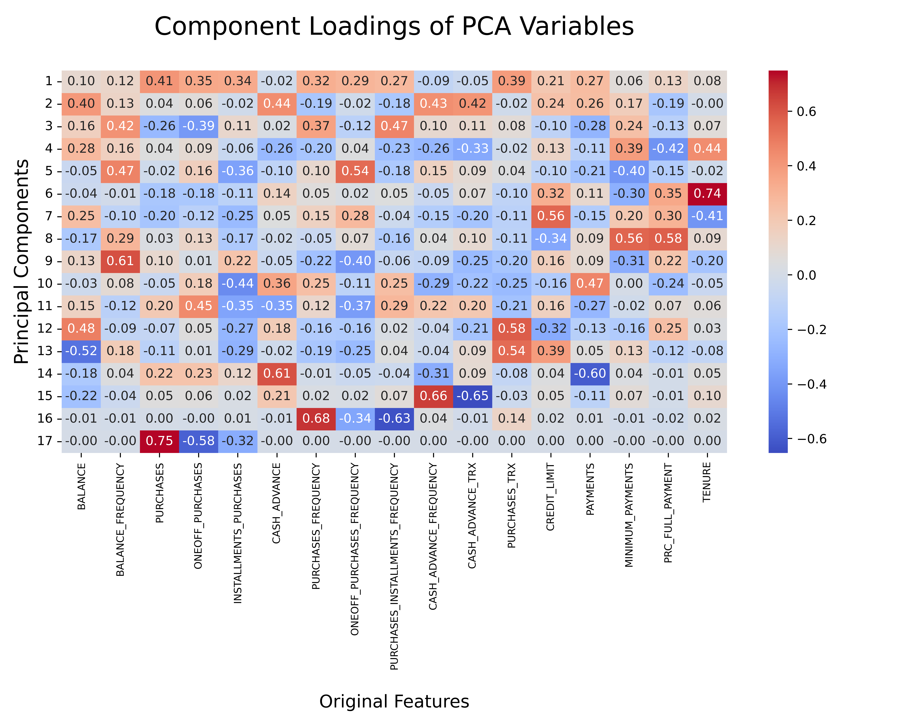
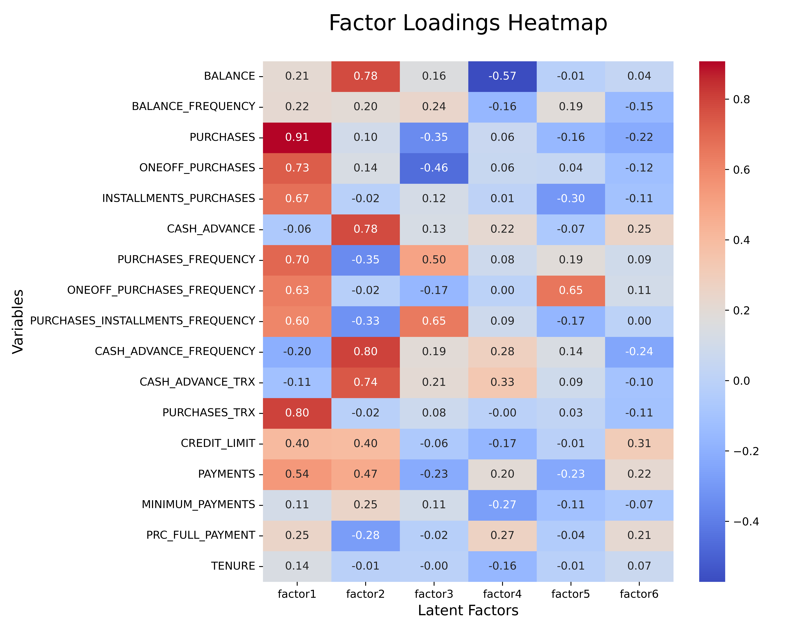

# SI-505 Multivariate Analysis Project

## Overview

This project is part of the **SI-505: Multivariate Analysis** course taken by **Prof. Siuli Mukhopadhyay**. It focuses on exploring different multivariate techniques such as PCA (Principal Component Analysis), factor analysis, and clustering. It involves analyzing a dataset to extract insights using various dimensionality reduction methods and clustering algorithms. The notebook also covers model evaluation and visualization of the results.

## Table of Contents

1. [Installation](#installation)
2. [Usage](#usage)
3. [Visualizations from Analysis](#visualizations-from-analysis)
4. [Contributing](#contributing)
5. [License](#license)

## Installation

### Prerequisites

Ensure you have the following installed on your system:

- Python (version 3.7 or higher)
- Jupyter Notebook or JupyterLab
- Necessary Python packages listed in `requirements.txt`

### Environment Setup

1. Clone the repository:

    ```bash
    git clone <repository-url>
    cd <repository-name>
    ```

2. Install dependencies:

    ```bash
    pip install -r requirements.txt
    ```

3. Open the Jupyter Notebook:

    ```bash
    jupyter notebook
    ```

## Usage

1. Run the `analysis-notebook.ipynb` in the `notebook` folder to explore the dataset and apply multivariate analysis techniques.
2. Follow the instructions in each cell to replicate the analysis.
3. Visualizations are embedded throughout the notebook to aid understanding.

## Visualizations from Analysis

### PCA Variance Explained

Shows cumulative variance explained by the principal components.


### PCA Component Loadings

Shows the loadings of original features on each principal component.


### Factor Loadings Heatmap

Displays factor loadings after factor analysis.


### Elbow Plot

Used to determine the optimal number of clusters for K-means clustering.


### Biplot

This plot displays clusters along with the principal components.


## Contributing

Contributions are welcome! Please follow the steps below:

1. Fork the repository.
2. Create a new branch for your modifications.
3. Ensure your changes are consistent with PEP 8 guidelines.
4. Submit a pull request for review.

## License

This project is licensed under the MIT License. See the `LICENSE` file for more details.
